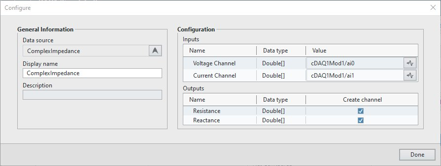

# Complex Impedance Plug-in

This plug-in computes the complex impedance (resistance and reactance) given a voltage and current signal.

## Supported versions of FlexLogger:

2025 Q2 and above

## Getting Started

- Make sure the system has the recommended Python version installed. Install Measurement Plug-In SDK for Python using [pip](https://pip.pypa.io/).
- Create a Python virtual environment named ```.venv``` in the same folder as the plug-in.

``` cmd
REM Activate the required virtual environment if any.
pip install ni-measurement-plugin-sdk
```
- Run .\start.bat to run the plug-in.
- Launch FlexLogger
- Configure a voltage and current channel
- Invoke the Complex Impedance plug-in by selecting Add channels>>Measurement Plug-in and selecting ComplexImpedance for the Data source.
- Set the Voltage Channel and the Current Channel.



- Click Done.


## Support

Please report any problem by filing an issue in github or in the FlexLogger forum:
https://forums.ni.com/t5/FlexLogger/bd-p/1021
