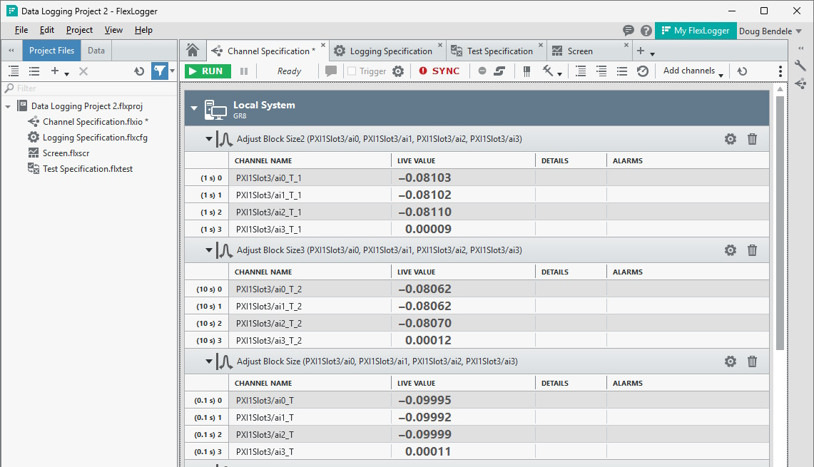
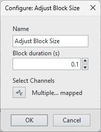

# FlexLogger Adjust Block Size Plug-in

This plug-in buffers continuous data channels acquired by FlexLogger and produces channels of continuous data at the user-configured block size. Configurable block size is useful for block-processing algorithms such as Discrete Fourier Transform (DFT), spectrogram, running level, statistical averaging, coherent processing, etc.

In the screenshot above, three different instances of this plugin have been configured with different block sizes. The same acquisition channels are selected as the inputs to each instance. The sample rate for that channel group is configured at 51200 Hz. The table below shows the output block size for each instance.

Plug-in Instance Name | Channel Labels | Block Duration (s) | Number of Samples
--- | :-: |  --: | --:
Adjust Block Size | (0.1 s)* | 0.100 | 5120
Adjust Block Size2 | (1 s)* | 1.000 | 51200
Adjust Block Size3 | (10 s)* | 10.000 | 512000

## PDK version used to build the plug-in

24.5

## Supported versions of FlexLogger:

2024 Q4 and above

## Getting Started

- Copy the content of the build folder in C:\Users\Public\Documents\National Instruments\FlexLogger\Plugins\IOPlugins\Adjust Block Size
- Launch FlexLogger
- Configure one or more channels
- Invoke this plug-in by selecting Add channels>>Plug-in>>Adjust Block Size
- Click the configure (gear) button on the right hand side of the plug-in.
- Configure **Block duration** to desired duration in seconds. 
   - Default = 0.1 s
   - Recommnded minimum = 0.001 s
   - Recommended maximum = 10 s
- Click the channel picker icon to select the channel(s) for which you want to output channels in blocks with specified duration.

Invalid configuration values will result in errors. Block duration must always include at least one sample and should always be a multiple of the sample interval (dt).

- Commit configuration by pressing **OK**
- Revert configuration changes by pressing **Cancel**

## Required Software for Modifying Source
- LabVIEW (Full Edition) 2024 Q1 or 2024 Q3
- Sound and Vibration Toolkit for LabVIEW 2023 Q3 or later

## Support

Please report any problem by filing an issue in github or in the FlexLogger forum:
https://forums.ni.com/t5/FlexLogger/bd-p/1021
