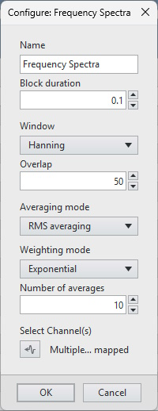

# FlexLogger DFT_Spectra Plug-in

This plug-in computes the Discrete Fourier Transform (DFT) of one or more channels and displays the frequency spectra results in a modal window.

## Interactive Features
Within this modal view, several interactive features enable thorough inspection of the frequency spectra.

### Measurement Cursors with Integrated Cursor Table
Multiple types of measurement cursors can be configured simultaneously. Each set of cursors can be configured independently. The configuration applies to all channels.

**Supported Cursors**
Type | Measurements | Configuration Notes
:-- | :-: | :--
XY | Frequency(i) Value(i) | 1..N reference frequencies supported
Harmonic | Harmonic Frequencies Harmonic Amplitudes | Fixed reference frequency or locked (tracking) to reference (first) channel fundamental
Sideband | Center and Sideband Frequencies Amplitudes | Number of sidebands and spacing from center
Band | b1 b2 b2-b1 (b2-b1)/(f2-f1) Band Average Band Power | Band edges move independently or specify 'fixed bandwidth' to move together

Enable and configure cursors by right clicking in the graph plot area and selecting _Configure Cursors..._

### Graph View Settings
Some applications favor a particular view of the spectrum. While running, several view options can be configured to inspect the data and identify the options that provide the best data insights.

**View Settings**
Settings | Supported Options
--- | ---
Pan and Zoom | Pan and zoom to any x- or y-subset of the frequency spectra to focus on data of interest
X-axis Maximum | Traditional (`0.39*Fs`)/Extended (`0.45*Fs`)/Nyquist (`0.5*Fs`)
X-axis Mapping | Linear/Logarithmic
Y-axis Mapping | Linear/Logarithmic/dB
Y-axis Scaling | Magnitude/Power Spectral Density/RMS/Peak/Peak-Peak
Frequency Weighting: Integration/Differentiation | Double Integration/Single Integration/No Change/Single Differentiation/Double Differentiation

View and Modify _View Settings_ using the graph right-click menus.

## Multiple Instances
This plug-in supports multiple instances within a FlexLogger project. Each instance maintains its own channel mapping, configuration, averaging state, and view state.

---
## PDK version used to build the plug-in

24.5

## Supported versions of FlexLogger

2024 Q4 and above

## Getting Started

- Copy the contents of the build folder to C:\Users\Public\Documents\National Instruments\FlexLogger\Plugins\IOPlugins\DFT_Spectra
- Launch FlexLogger
- Configure one or more channels
- Invoke this plug-in by selecting Add channels >> Plug-in >> Frequency Spectra
- Click the configure (gear) button on the right-hand side of the plug-in.
- Configure **Block duration** to achieve desired frequency resolution. Remember that frequency resolution equals the reciprocal of the block duration. Block duration, in seconds, can range from 0.01 s to 10 s (default = **0.1** s) and should include at least 64 samples.
- Configure **Window** to reduce spectral leakage.
- Configure **Overlap** to maintain sample coverage. The table below shows the recommended overlap for each supported window:

Window | Overlap
--- | :-:
None | 0
**Hanning** | **50**
Flat Top | 80
7-Term Blackman Harris | 75

- Configure averaging to balance signal-to-noise and responsiveness to changes in the signal.
   - Supported **Averaging mode** options: None | **RMS** | Peak Hold
      - Vector averaging not supported to avoid underreporting incoherent energy
   - Supported **Weighting mode** options: **Exponential**
   - Number of averages: 1..1000 (default = **10**)
      - **Averages completed** continues to increment to indicate the number of measurements since the last reset
- Click the channel picker icon to select the channel(s) for which you want to compute the frequency spectra.

Invalid configuration values will be coerced. Coerced values will be visible when reconfiguring the plug-in.

- Commit configuration by pressing **OK**
- Revert configuration changes by pressing **Cancel**

## Required Software for Modifying Source
- LabVIEW (Full Edition) 2024 Q1 or 2024 Q3
- Sound and Vibration Toolkit for LabVIEW 2023 Q3 or later

## Support

Please report problems by filing issues in GitHub or in the FlexLogger forum:
https://forums.ni.com/t5/FlexLogger/bd-p/1021
