# FlexLogger Output Sequencer Plug-in

This plug-in cycles through a user specified number of steps sequentially with a user defined duration for each step. The user can also add analog and digital output channels to define the values in each step. Here is a sample of what it looks like:

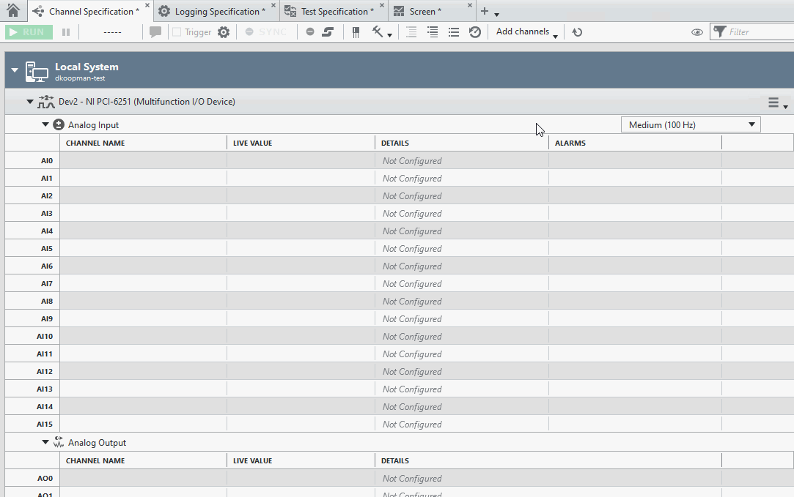

<!-- The comment below is a flag for the "Markdown All in One" Visual Studio Code plug-in which automatically updates the Table of Contents, and hides the "Table of Contents" section in the actual table of contents.--> 
<!-- omit in toc -->
## Table of Contents

- [FlexLogger Output Sequencer Plug-in](#flexlogger-output-sequencer-plug-in)
  - [PDK version used to build the plug-in](#pdk-version-used-to-build-the-plug-in)
  - [Supported versions of FlexLogger:](#supported-versions-of-flexlogger)
  - [Required Software for Modifying Source](#required-software-for-modifying-source)
  - [Getting Started](#getting-started)
  - [Advanced Features](#advanced-features)
  - [Conditional Execution](#conditional-execution)
    - [Mapping Conditional Channels](#mapping-conditional-channels)
    - [Referencing Conditional Channels](#referencing-conditional-channels)
    - [Sequence Conditional Execution](#sequence-conditional-execution)
    - [Step Conditional Execution](#step-conditional-execution)
  - [Expression Syntax](#expression-syntax)
    - [Channel Expressions](#channel-expressions)
    - [Conditional Expressions](#conditional-expressions)
    - [Operators](#operators)
    - [Functions](#functions)
    - [Constants](#constants)
  - [Sequencer States](#sequencer-states)
  - [Third-Party Dependencies](#third-party-dependencies)
  - [Support](#support)

## PDK version used to build the plug-in

24.5

## Supported versions of FlexLogger:

Supported in 2024 Q3 and above.
Included by default with installations of FlexLogger 2026 Q1 and later.

## Required Software for Modifying Source

- LabVIEW 2024 Q1 or 2024 Q3
- The following packages installed from JKI VI Package Manager:
  - JSONtext by JDP Science
  - muParser Expression Parser API by LAVA

See the [Third-Party Dependencies](#third-party-dependencies) section below for more information.

## Getting Started

- Copy the **build/Output Sequencer** folder from this repo to C:\Users\Public\Documents\National Instruments\FlexLogger\Plugins\IOPlugins.
    - **Note**: this step is not required for FlexLogger 2026 Q1 or later, since the plug-in is included and will be available by default.
- Launch FlexLogger and open a project
- Add the Output Sequencer plug-in by selecting Add channels>>Plug-in>>Output Sequencer
- This will open the Sequence Settings UI:

  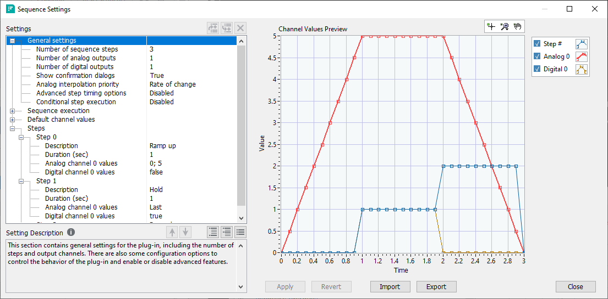

- Here you can specify the number of steps, number of output channels, the time to stay at each step in the sequence, sequence behaviors, and channel configurations. Clicking on each row in the table will display detailed help for that step in the "Setting Description" box in the bottom-left.

- For each step, you can define one or more values for each analog or digital value. For example, you can enter "1" to hold a channel at the value of 1 for the duration of the step. You can also use the `Last` keyword to hold an output at its previous value, or `Default` to set it back to its specified default value. Multiple values can be specified by using `;` as a delimiter. By default, the sequence will interpolate between the values you specify over the duration of the step, so entering "0; 5" would ramp an analog channel from 0 to 5 over the duration of the step.

- As changes are made, the Channel Preview Graph updates to show a visual representation of one iteration of the sequence. You must click the Apply button to accept these pending settings and have them reflected in the running sequence. You can also click the Revert button to discard any pending changes and go back to the previously applied settings.

- Once all the settings are applied, there will be four status channels, plus any analog or digital outputs defined.

  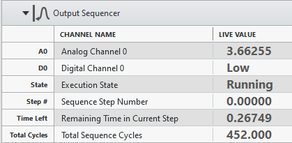

  | Channel| Description|
  |--------|------------|
  | Execution State | A short text description of the current state of the sequence, such as "Running", "Stopped", "Paused", "Wait for test", or "Wait for trigger". See the [Sequencer States](#sequencer-states) section for a list and description of all sequencer states. |
  | Sequence Step Number | The zero-based step index of the currently running step. This will have a value of -1 if the sequence isn't running. |
  | Remaining Time in Current Step | The amount of time left in the current step before moving to the next step. This will have a value of -1 if the sequence isn't running. |
  | Total Sequence Cycles | The number of times all the steps have completed and the sequence has started over at the beginning. This will have a value of -1 if the sequence isn't running. |

- The analog and digital channels you add can be mapped to DAQmx Analog and Digital Outputs so you can control output channels based on the values defined for the sequence:

  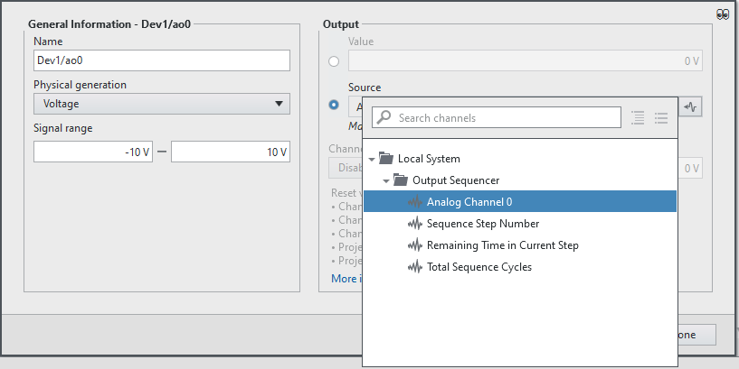

- The status channels can also be used to control test behavior by using them in alarms, events, or logging triggers. For example, you can use the logging stop trigger to have the test stop after a certain number of cycles:

  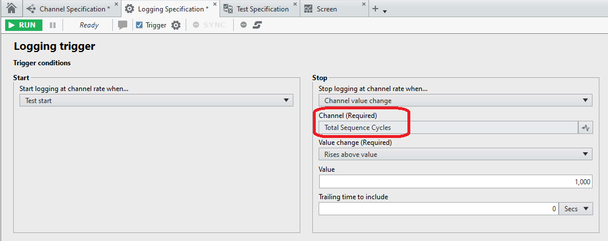

## Advanced Features

- Descriptions can be added to each step to understand what a step is doing at a glance, even when the step is collapsed in the settings table.

- Steps can be reordered by using the Up and Down arrow buttons below the table, or by dragging and dropping steps. You can also use the buttons above the table to remove the currently selected step or insert a new step above or below it. Step numbers will automatically be updated in response to any changes, and the graph will be updated to reflect the new order.

- Sequences can be imported and exported as .flxseq files. Any pending changes must be applied or reverted before a sequence can be exported. Importing a sequence will update the settings table and graph, but will not immediately be applied, giving you a chance to review the changes before applying or reverting them.

- The "Sequence execution" section allows you to control how and when your sequence runs. This includes whether execution should be tied to running a test, how long to delay after a test starts, how many times the sequence should run before stopping, and what values output channels should be set to when the sequence stops. There are also more advanced Start trigger and Stop condition settings, which are covered in the [Conditional Execution](#conditional-execution) section.

- The "Reset sequence" button can be used to reinitialize the sequence to its default state. This can be useful if the sequence is in the "Stopped" state and you want to restart it.
  
  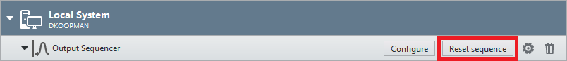

- You can have multiple instances of this plug-in if you have different sets of sequences to go through to control your project. These sequences run independently and can have different channels, lengths, and start/stop conditions.

- Enabling "Advanced step timing options" will create "Mode" and "Delay between values (sec)" settings for each step. This can be useful if you're using multiple values in a step and you want greater control on the output timing, instead of using the default behavior of interpolating between values.

- Enabling the "Conditional step execution" will create "Precondition" and "Post action condition" settings for each step. This allows you to skip steps, repeat steps, end the sequence, or jump to any other step based on conditional checks for each step. This is covered in more detail in the [Conditional Execution](#conditional-execution) section.

- In addition to the `Last` and `Default` keywords, channel values also support formulas. So if you wanted to have a channel start at its previous value, ramp up 5, then ramp back down to the previous value over the duration of the step, you could enter "Last; Last + 5; Last". See the  [Expression Syntax](#expression-syntax) section for more details.

- Step values also support the `t` keyword, which represents the number of seconds elapsed since the start of the current step. This allows more advanced time-based and trigonometric functions such as "Last + 0.5 * sin(t * pi)". See the  [Expression Syntax](#expression-syntax) section for more details.
  
  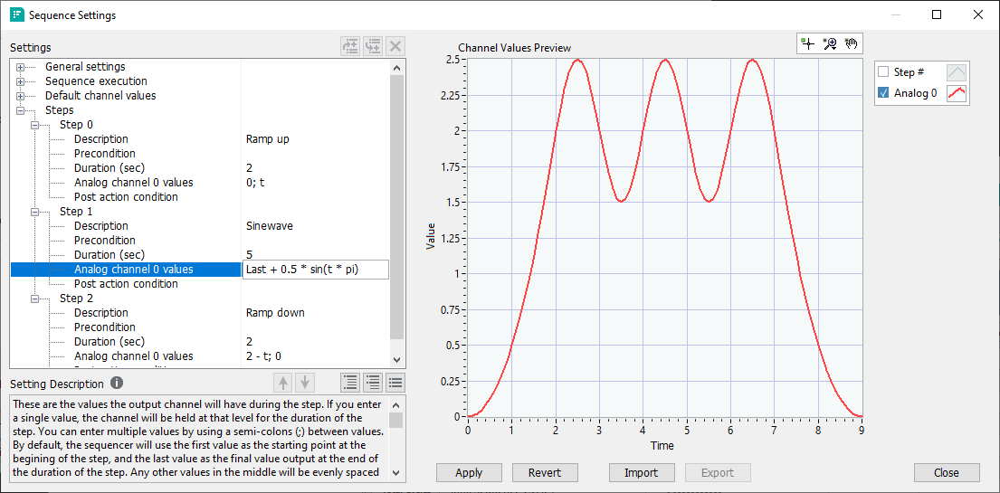

## Conditional Execution

There are several settings which allow you to control execution of your sequence based on conditional checks, typically related to the values of other channels in your system. These conditional expressions allow you to control the start and stop of your sequence, skip the execution of a step, and determine which action to take after a step is finished.

It is important to note that there may be a delay between when channel data is acquired and when it is read by the plug-in, so it is possible that the latest channel values available to the plug-in when the condition is evaluated are slightly in the past. For this reason, it is good practice to define your sequence in such a way that your values have had time to reach their expected value and settle before they are checked by a condition.

### Mapping Conditional Channels

In order to reference other channels in the system, they must first be mapped into the plug-in. First, click the gear button in the table header for the plug-in:

  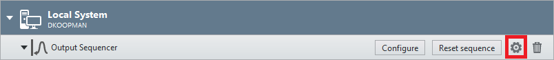

In the dialog, there will be channel selectors for Analog Conditional Channels and Digital Conditional Channels. Clicking the button under each setting will pop up a channel browser which will show available channels in your system. Analog Conditional Channels will show all analog input channels in your system, such as DAQ analog inputs and arithmetic formulas. Digital Conditional Channels will show all digital input channels in your system, such as DAQ digital inputs and Boolean formulas. Selecting one or more channels and then clicking the OK button will make the channels available to be used in conditional expressions.

Here is an example of selecting a Boolean formula channel named Emergency Stop:

  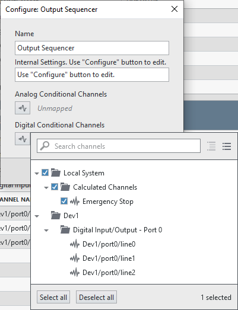

### Referencing Conditional Channels

When referencing mapped channels in conditional expressions, the channel names must be enclosed in single quotes (`'`). For example, to check whether a mapped analog input channel is greater than 5, you would enter:
'Dev1/ai0' > 5

It is important to note that there may be a delay between when channel data is acquired and when it is read by the plug-in, so it is possible that the latest channel values available to the plug-in when the condition is evaluated are slightly in the past. For this reason, it is good practice to ensure that your values have had time to reach their expected value and settle before they are checked by a condition.

For more information see the [Expression Syntax](#expression-syntax) and [Conditional Expressions](#conditional-expressions) sections below.

### Sequence Conditional Execution

The "Sequence execution" section of the settings dialog contains some conditional settings which affect the execution of the sequence:

| Setting | Description |
| ------- | ----------- |
| Start trigger condition | Waits until the condition is true before starting the sequence. This setting is ignored if empty. |
| Enable re-triggering | This controls whether the "Start trigger condition" is checked again when a running sequence is stopped. This setting is ignored if "Start trigger condition" is empty. |
| Stop condition | If this is true, the sequence will be immediately stopped if running, even in the middle of a step. If not running the sequence will be prevented from starting while the condition is true. This setting is ignored if empty. |

Here is an example of setting a Stop condition which references a Boolean formula channel named Emergency Stop, which was shown in the [Mapping Conditional Channels](#mapping-conditional-channels) section above. The 'Emergency Stop' channel is true when there is some critical condition, so it can be checked directly (which is the equivalent of checking 'Emergency Stop' == true).

  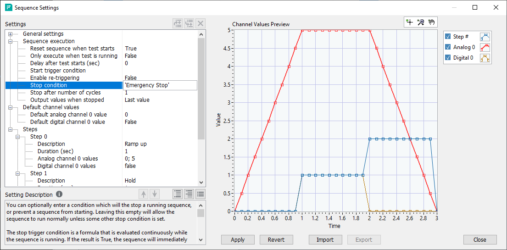

### Step Conditional Execution

If you enable the "Conditional Step Execution" option in the "General settings" section, each step will get some new settings which affect the execution and order of the sequence:

| Setting | Description |
| ------- | ----------- |
| Precondition | When the step is reached it will be executed if this is true, or skipped if it's false. This setting is ignored if empty. |
| Post action condition | After the step is finished, this condition is checked and one of the two below actions is performed. This setting is ignored if empty, and the action settings for the step will be hidden. |
| On condition True | If the "Post action condition" is true, this action will be performed. Refer to the table below for available actions. This setting will be hidden if "Post action condition" is not set on a step. |
| On condition False | If the "Post action condition" is false, this action will be performed. Refer to the table below for available actions. This setting will be hidden if "Post action condition" is not set on a step. |

"On condition True" and "On condition false" will have a drop-down list of available actions to be performed if the "Post action condition" is set:

| Action | Description |
| ------- | ----------- |
| (Empty) | If the action is left empty, it will proceed to the next sequential step as normal. This is the default action. |
| Repeat step | The current step will be repeated. |
| Stop sequence | The sequence execution will be stopped. |
| Go to # | Go directly to another step in the sequence instead of proceeding to the next step. This allows you to loop back to an earlier step, or jump ahead to later one. |

## Expression Syntax

Channel value and conditional expressions use the muParser library (see the [Third-Party Dependencies](#third-party-dependencies) section below for more details). This library supports parentheses, order of operations, and the operators, functions, and constants listed below. These can be combined to create simple or complex mathematical expressions. Supported keywords, constants, functions, and mapped channels will auto-complete while typing. Press the up/down keys while active to scroll through available matches, the Escape key to cancel, or the Tab key to accept the recommendation.

### Channel Expressions

Each channel expression can have one or more values or formulas separated by semi-colons (`;`). Channel expressions can also reference the following keywords:

| Keyword | Description |
| ------- | ----------- |
| Last | The final value of the previously completed step (or default value if the sequence has not yet run). |
| Default | The default value for the channel specified in the "Default channel values" section. |
| t | The number of seconds since the start of the current step. This can be useful in combination with trigonometric functions such as sin(t). |

Example channel expressions:

| Channel Expression | Description |
| ------- | ----------- |
| 5 | Outputs 5 for the duration of the step. |
| true | Outputs 1 (true) for the duration of the step. Useful for digital channels which only support 0 or 1. |
| Default | Sets the channel back to its default value for the duration of the step. |
| Last | Dwells/holds the channel at its previous value for the duration of the step. |
| 0; 5 | Ramp from 0 to 5 over the duration of the step. |
| Last; Last + 10 | Starts at the final value of the previous step and increases by 10 over the duration of the step. |
| 0; 2; 10 | Starts at 0, ramps to 2 over the first half of the step, then ramps to 10 over the second half. |
| 2 * sin(t - pi) | Outputs a a sine wave for the duration of the step with an amplitude of 2, period of 2 * pi seconds, and a phase shift to the right by pi seconds. |
| Last > 5 ? 10 : 0 | Uses the conditional ternary operator (`?:`) to change the output depending on the Last value. If the value is greater than 5, a value of 10 is output. Otherwise, a value of 0 is output. |

Here is an example of a sequence which will continually repeat a step and hold the output at the last value as long as an analog input channel is greater than 7. As soon as the analog channel is less than or equal to 7, the next step (Step 2 - Ramp down) will be executed. If the analog input channel is less than 7 when this step is reached, it will be skipped entirely since it is also set as the Precondition.

  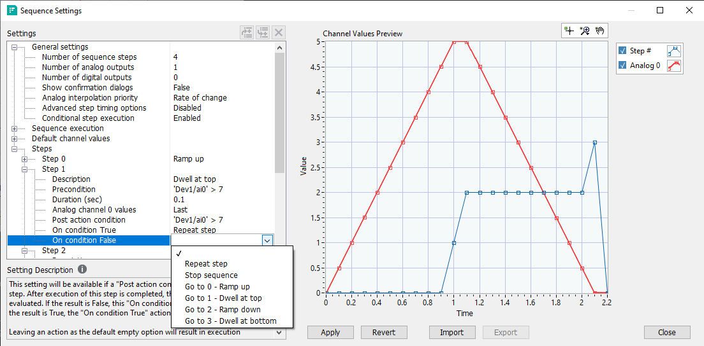

### Conditional Expressions

Each conditional expression is a formula which should evaluate to true or false, typically by checking a digital channel or using a comparative operator like `>=`. If the formula evaluates to a numeric result, a value of 0 is considered false, and any non-zero value will be treated as true. Any referenced channels need to be enclosed in single quotes (`'`). Ex. 'My Channel'

Example conditional expressions:

| Conditional Expression | Description |
| ------- | ----------- |
| 'Emergency Stop' | Returns true if the digital 'Emergency Stop' channel is true, otherwise false. Using this expression for the "Stop condition" setting would immediately stop the sequence if 'Emergency Stop' was set. |
| !'Critical Temp' | Inverts the value of the digital channel 'Critical Temp'. Returns true if the channel is false, or false if the channel is true. |
| 'RPM' > 6000 | Returns true is the analog channel 'RPM' is greater than 6000, otherwise false. |
| 'Voltage' * 'Current' <= 60 | Returns true if the power calculation of multiplying the 'Voltage' channel by the 'Current' channel is less than 60, otherwise false. |

### Operators

| Binary Operator | Description | Priority |
| --------------- | ----------- | -------- |
| \|\| | logical or | 1 |
| && | logical and | 2 |
| \| | bitwise or | 3 |
| ^ | bitwise exclusive or | 4 |
| & | bitwise and | 5 |
| <= | less or equal | 6 |
| >= | greater or equal | 6 |
| != | not equal | 6 |
| == | equal | 6 |
| > | greater than | 6 |
| < | less than | 6 |
| + | addition | 7 |
| - | subtraction | 7 |
| * | multiplication | 8 |
| / | division | 8 |
| % | floating point modulo | 8 |
| ^ | raise x to the power of y | 8 |

| Unary Operator | Description |
| ---------------- | ----------- |
| ! | logical not |
| ~ | bitwise not |

| Ternary Operator | Description | Remarks |
| ---------------- | ----------- | ------- |
| ?: | if then else operator | C++ style syntax. Ex. "Last > 5 ? 10 : 0" |

### Functions

| Function | Arguments | Explanation |
| -------- | --------- | ----------- |
| sin | 1 | sine function |
| cos | 1| cosine function |
| tan | 1| tangent function |
| asin | 1 | inverse sine function |
| acos | 1 | inverse cosine function |
| atan | 1 | inverse tangent function |
| sinh | 1 | hyperbolic sine function |
| cosh | 1 | hyperbolic cosine |
| tanh | 1 | hyperbolic tangent function |
| asinh | 1 | inverse hyperbolic sine function |
| acosh | 1 | inverse hyperbolic cosine function |
| atanh | 1 | inverse hyperbolic tangent function |
| log2 | 1 | logarithm to the base 2 |
| log10 | 1 | logarithm to the base 10 |
| log | 1 | logarithm to base e (2.71828...) |
| ln | 1 | logarithm to base e (2.71828...) |
| exp | 1 | e raised to the power of x |
| sqrt | 1 | square root of a value |
| sign | 1 | sign function -1 if x < 0; 1 if x > 0 |
| rint | 1 | round to nearest integer |
| abs | 1 | absolute value |
| min | var. | min of all arguments |
| max | var. | max of all arguments |
| sum | var. | sum of all arguments |
| avg | var. | mean value of all arguments |

### Constants

| Constant | Description | Remarks |
| -------- | ----------- | ------- |
| pi | The one and only pi. | 3.141592653589793238462643 |
| e | Euler's number. | 2.718281828459045235360287 |
| true | Boolean true. | 1 |
| false | Boolean false. | 0 |

## Sequencer States

| 
State
 | Description |
| -------------------------------------- | ----------- |
| Prepare channels | The sequencer is waiting until all channels mapped into the plug-in have a valid value. Usually this happens instantaneously, but may take several seconds if you have a really slow channel mapped into your plug-in (ex. a thermocouple that only acquires once every 10 seconds). |
| Wait for test | The sequencer is waiting for the test to start. This will happen if up if the "Only execute when test is running" option is set and a test is not running. |
| Wait for # sec | The sequencer is waiting the displayed number of seconds before starting. This will happen if "Delay after test starts (sec)" is set to a non-zero value, and the "Only execute when test is running" or "Reset sequencer when test starts" options are set. |
| Wait for trigger | The sequencer is waiting for the defined "Start trigger condition" to evaluate to true. |
| Stop condition | While waiting for a start trigger, the "Stop condition" evaluated to true. Execution will stay in this state until the "Stop condition" is cleared, then will go back to the "Wait for trigger" state. |
| Wait for resume | While waiting for a start trigger, the test was paused. This will only happen if the "Only execute when test is running" setting is enabled. Execution will stay in this state until the test is unpaused, then will go back to the "Wait for trigger" state. |
| Running | The defined sequence is running. The "Sequence Step Number", "Remaining Time in Current Step", and "Total Sequence Cycles" channels will reflect the current status of the sequence. |
| Paused | While running the sequence, the test was paused. This will only happen if the "Only execute when test is running" setting is enabled. All values will be held at their previous values while paused. Execution will stay in this state until the test is unpaused, then will go back to the "Running" state and resume execution from when the point when it was paused. |
| No valid step | The sequencer attempted to move to the next step but was unable to find any step to execute. This is a rare situation, and can only occur if every step has a "Precondition" defined and all preconditions evaluate to false. Execution will stay in this state until one or more steps have a valid precondition. Evaluation of preconditions will always start at the next step that would have been run when entering this state, and proceed sequentially through the rest of the steps (looping back to Step 0 if necessary). |
| Stopped | The sequence was previously running and has now been stopped. This could occur if the maximum cycles has been reached, the "Stop condition" occurred, or a step post action stopped the sequence. If the "Only execute when test is running" or "Reset sequencer when test starts" options are set, the test will re-start whenever the next test is started. The sequence can also be manually restarted by clicking the "Reset sequence" button in the plug-in table header in the Channel Specification document. This state will not occur if a "Start trigger condition" is defined and "Enable re-triggering" is enabled, since it will immediately begin checking for a new start trigger instead. |
| Error | The sequencer encountered an error. Usually this would occur if the settings applied were invalid or contained an error, such as a conditional channel referencing an unknown channel that is not mapped into the plug-in. See the "Errors and Warnings" list at the bottom of FlexLogger for more information about the error. |

## Third-Party Dependencies

In order to open and build the source code, you will need to install the following packages using JKI VI Package Manager:
- JSONtext by JDP Science
- muParser Expression Parser API by LAVA

The full list of third-party dependencies used are listed below:

| Dependency | Author | Repo | License |
| ----------- | ----------- |----------- | ----------- |
| [JSONtext](https://www.vipm.io/package/jdp_science_jsontext/) | JDP Science | [Bitbucket](https://bitbucket.org/drjdpowell/jsontext/src/master/) | [License](./third_party/JDP%20Science/license%20JSONtext.txt) |
| [JDP Science Common Utilities](https://www.vipm.io/package/jdp_science_lib_common_utilities/) | JDP Science |  | [License](./third_party/JDP%20Science/license.txt) |
| [muParser API for LabVIEW](https://www.vipm.io/package/lv_muparser/) | Ryan Porter | [GitHub](https://github.com/rfporter/LV-muParser) | [License](./third_party/LV-muParser/LICENSE.txt) |
| [muParser - Fast Math Parser Library](https://beltoforion.de/en/muparser/) | Ingo Berg | [GitHub](https://github.com/beltoforion/muparser) | [License](./third_party/muparser/LICENSE.txt) |

## Support

Please report any problem by filing an issue in GitHub or in the FlexLogger forum:
https://forums.ni.com/t5/FlexLogger/bd-p/1021