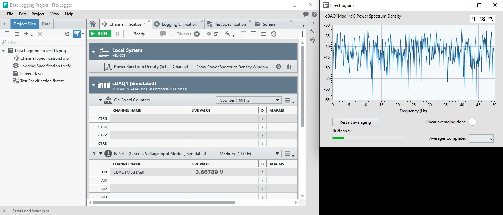

# FlexLogger Power Spectrum Density Plug-in

This plug-in demonstrates how to display an external window using the PDK that computes the power spectrum density of a channel.

## PDK version used to build the plug-in

1.7

## Supported versions of FlexLogger:

2023 Q3 and above

## Getting Started

- Copy the content of the build folder in C:\Users\Public\Documents\National Instruments\FlexLogger\Plugins\IOPlugins\Power Spectrum Density
- Launch FlexLogger
- Configure a channel
- Invoke the Power Spectrum Density plug-in by selecting Add channels>>Plug-in>>Power Spectrum Density
- Click the configure (gear) button on the right hand side of the plug-in.
- Choose the options, select a channel to compute the power spectrum density and click OK.
- A windows pops up showing the power spectrum density of the channel.
- If you close the window, you can reopen it by clicking the "Show Power Spectrum Density Window" button on the right hand side of the plug-in.

## Support

Please report any problem by filing an issue in github or in the FlexLogger forum:
https://forums.ni.com/t5/FlexLogger/bd-p/1021
