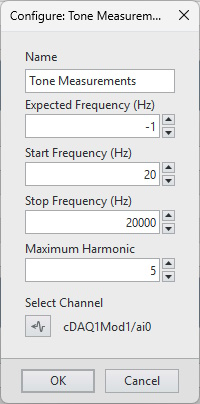

# Tone Measurements Plug-in

This plug-in measures the following signal quantities and creates output channels for each:
- AC Level
- Band Level
- DC Level
- Spurious-Free Dynamic Range (SFDR)
- Signal-to-Noise Ratio (SNR)
- Signal In Noise And Distortion (SINAD)
- Total Harmonic Distortion (THD)
- Fundamental Frequency
- Fundamental Amplitude
- Harmonic Amplitudes (2..5)*

*Output channels are created for these harmonic amplitudes regardless of the setting for **Maximum Harmonic**. Harmonics 6.. may be used in calculations, but they will not be shown in the channel table, on screen, nor logged to file.

## PDK version used to build the plug-in

25.5

## Supported versions of FlexLogger:

2025 Q3 and above

## Getting Started

- Copy the content of the build folder in C:\Users\Public\Documents\National Instruments\FlexLogger\Plugins\IOPlugins\Tone Measurements
- Launch FlexLogger
- Configure one channel
- Invoke this plug-in by selecting Add channels>>Plug-in>>Tone Measurements
- Click the configure (gear) button on the right hand side of the plug-in.
- Configure **Expected Frequency** if known. If set to a negative frequency, the plugin will detect and use the highest-amplitude component within the specified frequency band. The plugin will automatically choose a measurement duration to provide frequency resolution sufficient to resolve fundamental and harmonics.
- Configure **Start Frequency** and **Stop Frequency** to define the frequency band of interest.
- Configure **Maximum Harmonic** to specify max harmonic to use in THD computation. Select '-1' to use all harmonics in band. 
- Click the channel picker icon to select the channel for which you want to compute tone measurements.

- Commit configuration by pressing **OK**
- Revert configuration changes by pressing **Cancel**

## Required Software for Modifying Source
- LabVIEW (Full Edition) 2025 Q1 or 2025 Q3
- Sound and Vibration Toolkit for LabVIEW (Base Edition) 2023 Q3 or later

## Support

Please report any problem by filing an issue in github or in the FlexLogger forum:
https://forums.ni.com/t5/FlexLogger/bd-p/1021
