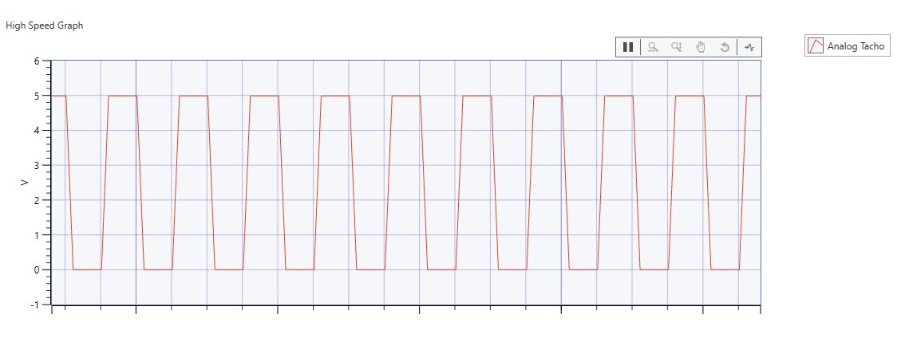
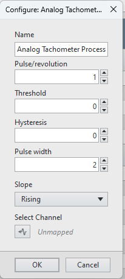
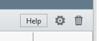
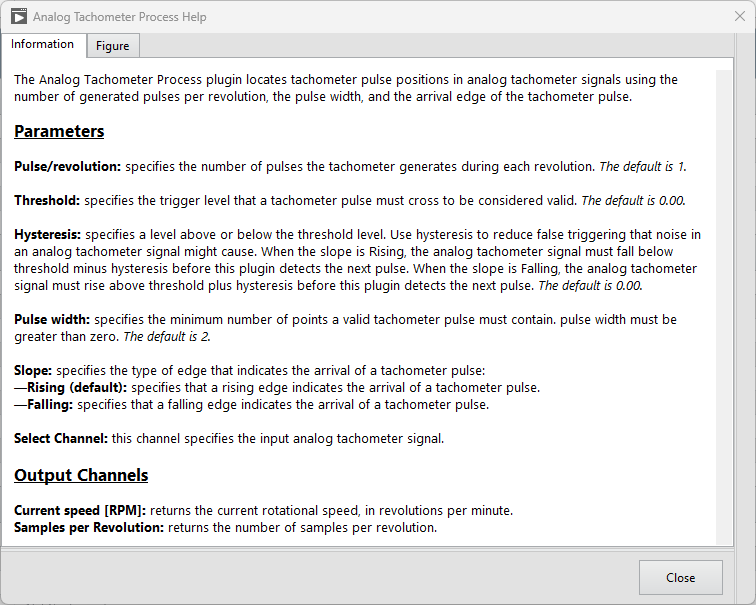
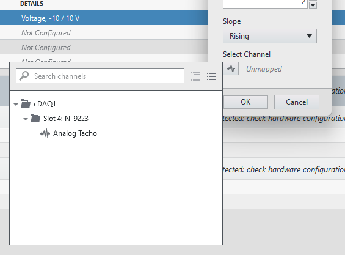
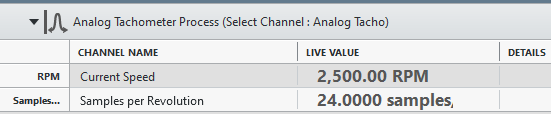

# FlexLogger Analog Tachometer Process Plug-in

This plugin locates tachometer pulse positions in analog tachometer signals using the number of generated pulses per revolution, the pulse width, and the arrival edge of the tachometer pulse.

## PDK version used to build the plug-in

25.5 (refer to [FlexLogger Plug-in Development Kit Compatability](https://www.ni.com/en/support/documentation/compatibility/25/flexlogger-plug-in-development-kit-compatibility-with-flexlogger-and-labview.html) for more information)

## Supported versions of FlexLogger:

2025 Q3 or later

## Required Software for Modifying Source

- LabVIEW 2025 Q1 or 2025 Q3 (64-bit)
- [LabVIEW Sound and Vibration Toolkit](https://www.ni.com/en/support/downloads/software-products/download.labview-sound-and-vibration-toolkit.html)

## Getting Started

- Copy the **build/Analog Tachometer Process** folder from this repo to C:\Users\Public\Documents\National Instruments\FlexLogger\Plugins\IOPlugins\
- Launch FlexLogger and open a project
- Configure an analog input channel to acquire the analog tachometer signal 

- Add the Analog Tachometer Process plug-in by selecting Add channels>>Plug-in>>Analog Tachometer Process
- Click the configure (gear) button on the right hand side of the plug-in
- Select the options for how to locate tachometer pulse positions in analog tachometer signals

- Select the Help button to the left of the configure (gear) button to display a dialog with descriptions of each option

- Select the analog input channel for which to process tachometer pulse positions

- Press **OK**

- **Current speed [RPM]:** returns the current rotational speed, in revolutions per minute.
- **Samples per Revolution:** returns the number of samples per revolution.

Press the Run button to start the test. Press Stop to finish logging and create the TDMS file. 

## Support

Please report any problem by filing an issue in github or in the FlexLogger forum: https://forums.ni.com/t5/FlexLogger/bd-p/1021