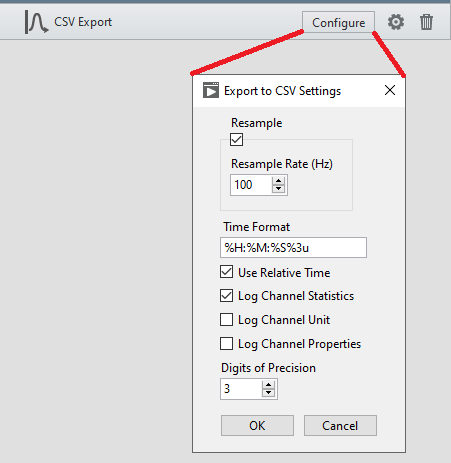
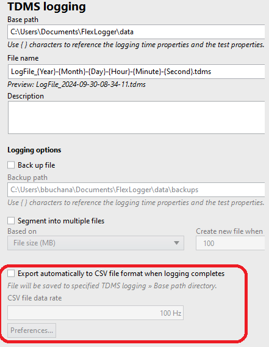

# CSV Export

This plug-in provides more formatting options for CSV files. Here are the available options:

When a TDMS file is created, this Plug-in uses the **Handle Message.vi** to get notified about the path to the TDMS file. It then reads the file and formats the data into a CSV file using the configured parameters.
It also uses the PluginSDK's AttributeManager to **ensure only 1 instance of the plug-in can run at a time**.
Make sure you turn off the Export to CSV option in the FlexLogger project to avoid possibly overwriting this plug-in's csv file.

## PDK version used to build the plug-in
1.5

## Supported versions of FlexLogger:
FlexLogger 2023 Q1 or later.

## Getting Started
- Copy the **build/CSV Export** folder from this repo to C:\Users\Public\Documents\National Instruments\FlexLogger\Plugins\IOPlugins\
- Launch FlexLogger and open a project
- Add the CSV Export plug-in by selecting Add channels>>Plug-in>>CSV Export
- Click the **Configure** button on the right hand side of the plug-in
- Select the options for how to format the CSV file. The **Time Format** uses modifiers listed [here](https://www.ni.com/docs/en-US/bundle/labview-api-ref/page/vi-lib/string/format-codes-for-the-time-format-string.html)
- Press **OK**
- Configure some channels to log and Press the **Run** button to start the test. Press **Stop** to finish logging and create the TDMS file. This will cause the CSV Export plug-in to create a CSV file using the specified parameters in the same folder as the TDMS file and with the same name, but with a csv file extension.

## Support
Please report any problem by filing an issue in github or in the FlexLogger forum:
https://forums.ni.com/t5/FlexLogger/bd-p/1021
