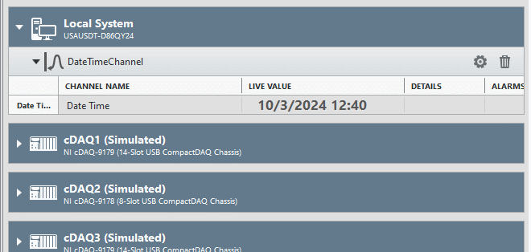
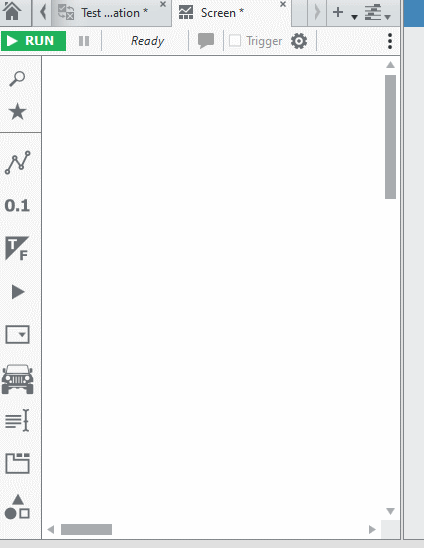

# DateTimeChannel

This plug-in illustrates how to use a string channel in FlexLogger.

Here's how it looks when using the result of the channel on the Screens tab:

## PDK version used to build the plug-in

1.7

## Supported versions of FlexLogger:

FlexLogger 2023 Q3 or later.

## Getting Started

- Copy the **build/DateTimeChannel** folder from this repo to C:\Users\Public\Documents\National Instruments\FlexLogger\Plugins\IOPlugins\
- Launch FlexLogger and open a project
- Add the DateTimeChannel plug-in by selecting Add channels>>Plug-in>>DateTimeChannel
- Click the configure (gear) button on the right hand side of the plug-in to edit the formatting.
- You can see the available date and time formatting options [here](https://www.ni.com/docs/en-US/bundle/labview-api-ref/page/vi-lib/string/format-codes-for-the-time-format-string.html)
- Press **Done**
- Now you can use this date/time to display on the Screens tab and change the style, font, size, etc. as needed.

## Support

Please report any problem by filing an issue in github or in the FlexLogger forum:
https://forums.ni.com/t5/FlexLogger/bd-p/1021
