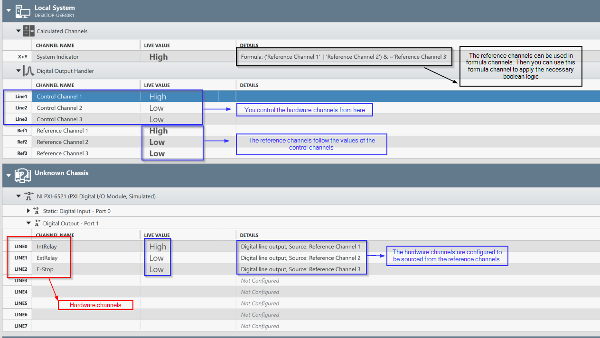
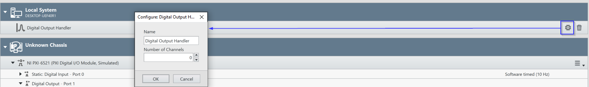
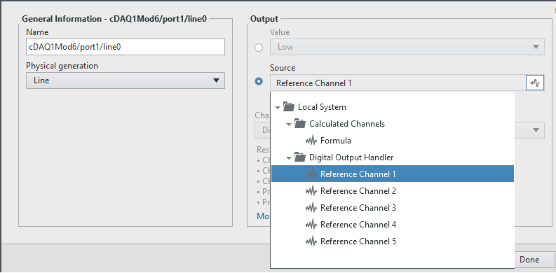
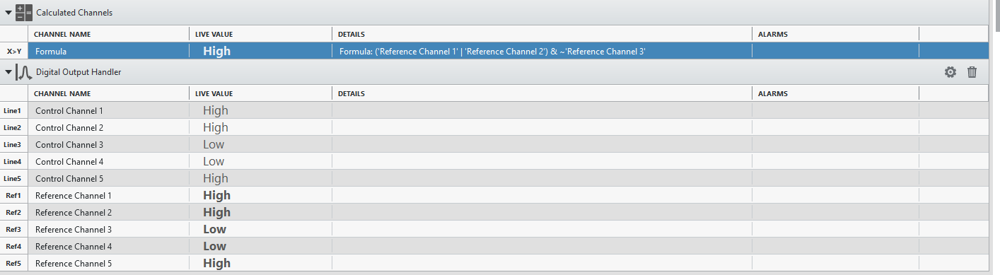
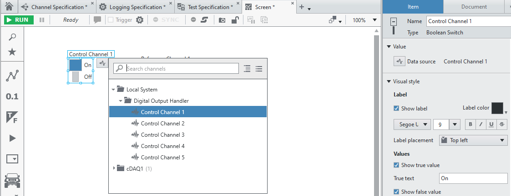

# Digital Output Handler

This plug-in creates digital output channels that are mapped to digital input channels also created by the plug-in with a user specified number of these channel pairs. This can be useful since some functionality in FlexLogger only supports using digital inputs and this plugin allows user control of digital output channels that map to digital input channels.
For example, the Boolean Formula channel can only use input channels and so if you wanted to create some logic that related to the state of a DAQmx digital output line you could use this step to accomplish that. See this sample:

## PDK version used to build the plug-in
1.7

## Supported versions of FlexLogger:
FlexLogger 2023 Q3 and later

## Getting Started
- Copy the **build/Digital Output Handler** folder from this repo to C:\Users\Public\Documents\National Instruments\FlexLogger\Plugins\IOPlugins\
- Launch FlexLogger and open a project
- Add the Digital Output Handler plug-in by selecting Add channels>>Plug-in>>Digital Output Handler
- Click the **Configure** button on the right hand side of the plug-in to specify the number of channels to configure:

- Now you can map the "Reference Channels" from this plugin to driver DAQmx digital outputs:

and also use these reference channels in Boolean Formula channels:

and all of this will be controlled from the "Control Channels" of this plugin which can be controlled from the Channel Specification table or the Screen user interface using a button for example:

## Support
Please report any problem by filing an issue in github or in the FlexLogger forum:
https://forums.ni.com/t5/FlexLogger/bd-p/1021
