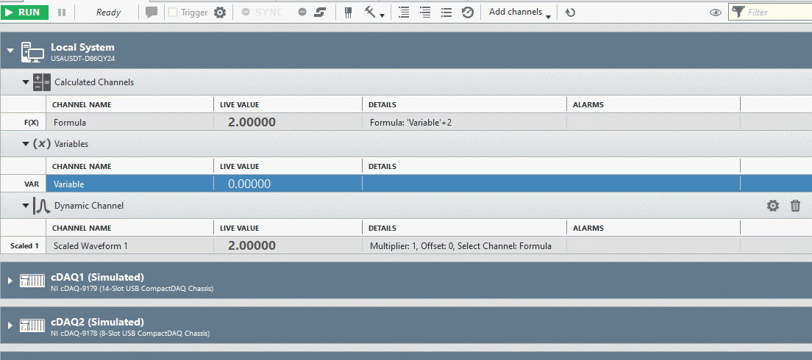

# Dynamic Channel

This is a simple example to illustrate how to dynamically change the number of channels produced by a plug-in. 

It was created by following the directions in **FlexLogger Plug-in Development Kit Manual.pdf**

Since DAQ channels already have multiplier and offset values built into their configuration, this plug-in isn't that useful, but hopefully it will provide a good guide for how to dynamically change the number of channels produced by the plug-in so other real-world use cases can benefit from this example.

## PDK version used to build the plug-in

1.3

## Supported versions of FlexLogger:

FlexLogger 2020R3 or later

## Getting Started

- Copy the **build/Dynamic Channel** folder from this repo to C:\Users\Public\Documents\National Instruments\FlexLogger\Plugins\IOPlugins\
- Launch FlexLogger and open a project
- Add the Dynamic Channel plug-in by selecting Add channels>>Plug-in>>Dynamic Channel
- Click the configure (gear) button on the right hand side of the plug-in
- Specify the number of channels you want the plug-in to have
- Press **Done**
- For each channel, you can click on the gear to left of the channel and associated it with a different FlexLogger channel to apply the multiplier and offset to.

## Support

Please report any problem by filing an issue in github or in the FlexLogger forum:
https://forums.ni.com/t5/FlexLogger/bd-p/1021
