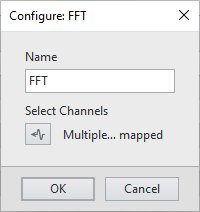
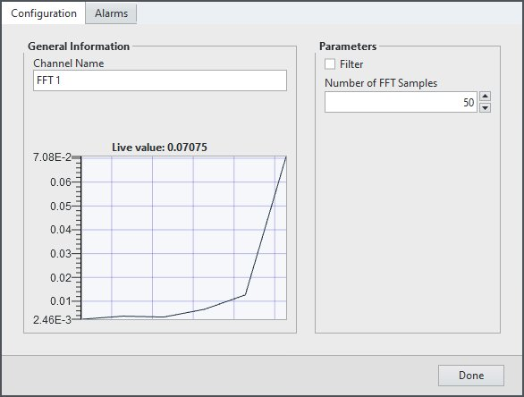

# FlexLogger FFT Plug-in

This plug-in computes the FFT of one or more channels, and outputs the result in new channels that you can log to file.

## PDK version used to build the plug-in

24.5

## Supported versions of FlexLogger:

2024 Q4 and above

## Getting Started

- Copy the content of the build folder in C:\Users\Public\Documents\National Instruments\FlexLogger\Plugins\IOPlugins\FFT
- Launch FlexLogger
- Configure one or more channels
- Invoke the FFT plug-in by selecting Add channels>>Plug-in>>FFT
- Click the configure (gear) button on the right hand side of the plug-in.
- Click the channel picker icon to select the channel for which you want to compute the FFT and click OK.
Note: If the "Number of FFT Samples" is too small, multiple FFT calculations will be performed in a single cycle to ensure we don't fall behind.

- Click the channel configuration button (gear) to the left of the FFT channel to spefify whether you want to add filtering and the number of FFT samples desired, then click Done.

## Support

Please report any problem by filing an issue in github or in the FlexLogger forum:
https://forums.ni.com/t5/FlexLogger/bd-p/1021
