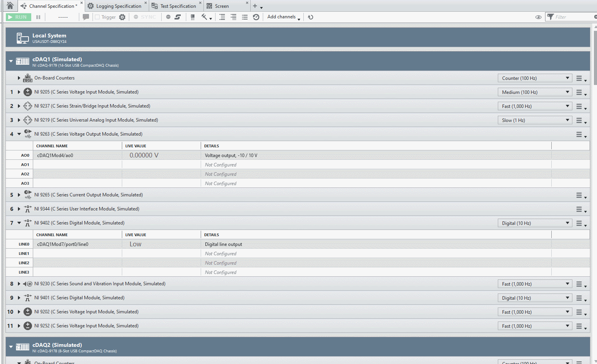
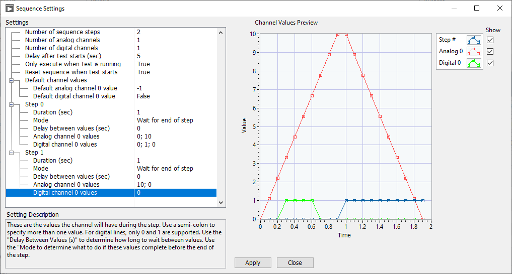
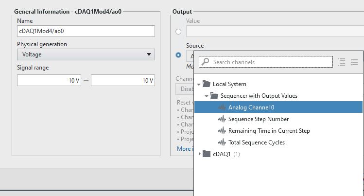
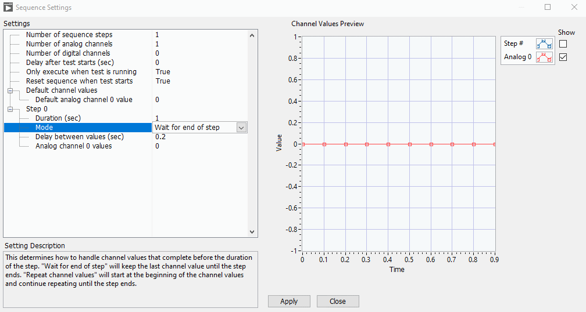
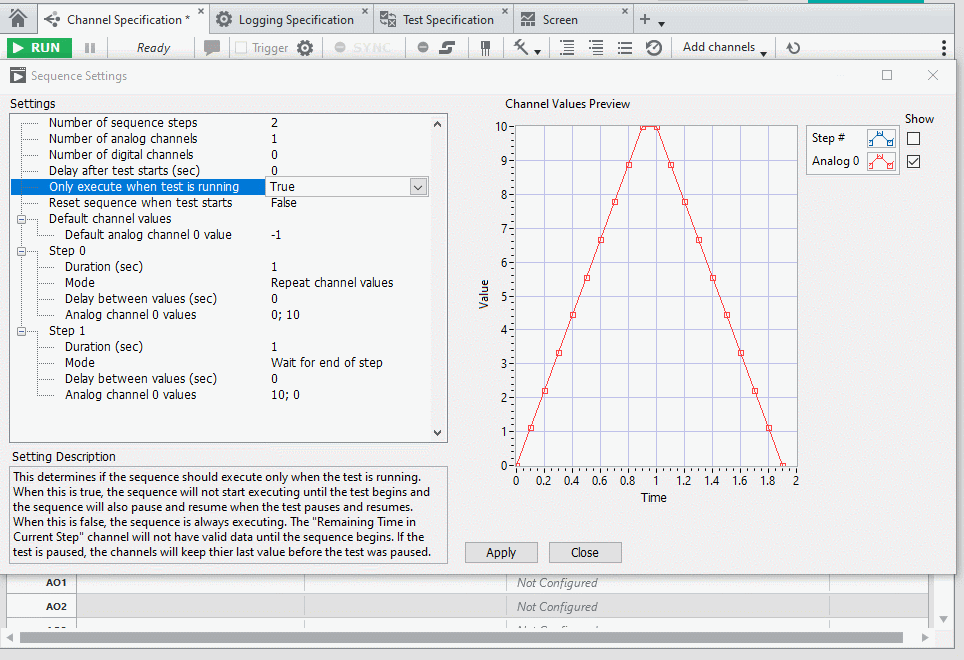
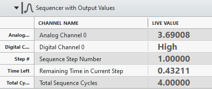
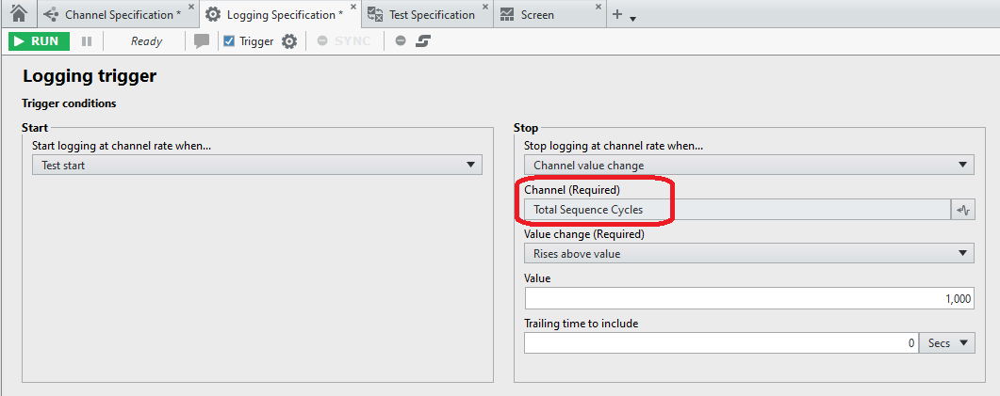

# FlexLogger Test Sequencer Plug-in

This plug-in cycles through a user specified number of steps sequentially with a user defined duration for each step. The user can also define analog and digital channels to define the values in each step. Here is a sample of what it looks like:

## PDK version used to build the plug-in

24.5

## Supported versions of FlexLogger:

2024 Q3 and above

## Getting Started

- Copy the **build/Sequencer with Output Values** folder from this repo to C:\Users\Public\Documents\National Instruments\FlexLogger\Plugins\IOPlugins
- Launch FlexLogger and open a project
- Add the Sequencer plug-in by selecting Add channels>>Plug-in>>Sequencer with Output Values
- This will open the Sequence Settings UI:

- Here you can specify the number of steps, the time to stay at each step in the sequence, sequence behaviors, and channel configurations. Each setting has detailed help that is part of the Sequence Settings UI.
- The analog and digital channels you add can be mapped to DAQmx Analog and Digital Outputs so you can control output channels based on the values defined for the sequence:

- It's also important to note that you can have multiple values for the channels defined during a single step and the step settings allow you to determine the behavior if the values complete before the duration of the step completes:

Note: When "Delay between values" is 0, the values will be interpolated over the duration of the step.

- There is a setting named "Reset sequence when test starts" that controls whether the cycles and step counter should reset when the test starts. This plug-in uses a callback in the **Handle Notification.vi** to know when the test starts.

- Another setting that determines sequence behavior is named "Only execute when test is running". When this is true, the "Reset sequence when test starts" is ignored since that will be overridden by this setting and will always cause the sequence to reset when the test starts. It will also result in the sequence not running when the test isn't running and the sequence will pause and resume when the test pasues and resumes. This is when it's important to specify the default values for the analog and digital channels since that will be what is used when the sequence is not running. When the sequence is paused, it will use the last values on the channel before it was paused. Here is an example of what that behavior looks like:

- Another useful setting is "Delay after test starts", which allows for the sequence to delay a user specified number of seconds until after a test begins. This can allow values to settle and everything to be logging to TDMS to ensure nothing is missed and channels start in a known state. This setting is only supported when either "Only execute when test is running" or "Reset sequence when test starts" is true.

Once all the settings are configured, press **Apply** in the Sequnce Settings UI. After configuring this, there are three channels produced by this step, plus any analog or digital channels defined:

- Sequence Step Number - The zero based step index that is currently waiting for the specified duration before moving to the next step.
- Remaining Time in Current Step - The amount of time left in the current step before moving to the next step. This will have a value of -1 when the sequence hasn't started yet.
- Total Sequence Cycles - The number of times all the steps have completed and the sequence has started over at the beginning.

You can have multiple instances of this plug-in if you have different sets of sequences to go through to control your project.

You can use the logging stop trigger to have the test stop after a certain number of cycles:

  

## Support

Please report any problem by filing an issue in github or in the FlexLogger forum:
https://forums.ni.com/t5/FlexLogger/bd-p/1021
