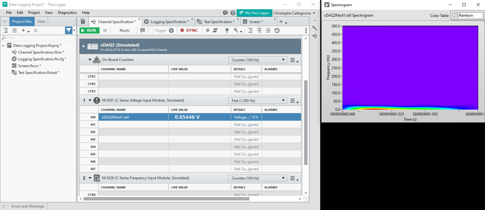

# FlexLogger Spectrogram Plug-in

This plug-in demonstrates how to display an external window using the PDK that computes the spectrogram of a channel.

## PDK version used to build the plug-in

1.7

## Supported versions of FlexLogger:

2023 Q3 and above

## Getting Started

- This plug-in makes use of the LabVIEW Advanced Signal Processing Toolkit.
If you want to open the source code, you need to have the toolkit installed.
You can download the toolkit at the following address:
https://www.ni.com/en/support/downloads/software-products/download.labview-advanced-signal-processing-toolkit.html
You don't need the toolkit to run the plug-in.
- Copy the content of the build folder in C:\Users\Public\Documents\National Instruments\FlexLogger\Plugins\IOPlugins\Spectrogram
- Launch FlexLogger
- Configure a channel
- Invoke the Spectrogram plug-in by selecting Add channels>>Plug-in>>Spectrogram
- Click the configure (gear) button on the right hand side of the plug-in.
- Choose the options, select a channel to compute the spectrogram and click OK.
- A windows pops up showing the spectrogram of the channel.
- If you close the window, you can reopen it by clicking the "Show Spectrogram Window" button on the right hand side of the plug-in.

## Support

Please report any problem by filing an issue in github or in the FlexLogger forum:
https://forums.ni.com/t5/FlexLogger/bd-p/1021
