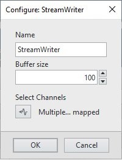
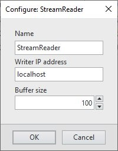

# FlexLogger Spectrogram Plug-in

This plug-in demonstrates how to stream data to LabVIEW or another instance of FlexLogger.

## PDK version used to build the plug-in

24.5

## Supported versions of FlexLogger:

2024 Q4 and above

## Getting Started

- Copy the content of the StreamWriter build folder in C:\Users\Public\Documents\National Instruments\FlexLogger\Plugins\IOPlugins\StreamWriter
- Copy the content of the StreamReader build folder in C:\Users\Public\Documents\National Instruments\FlexLogger\Plugins\IOPlugins\StreamReader
- Launch FlexLogger
- Configure some channels
- Add the StreamWriter plug-in by selecting Add channels>>Plug-in>>StreamWriter
- Click the configure (gear) button on the right hand side of the plug-in.
- Click the channel picker icon to select the channels you want to stream, then click OK.

- Add the StreamReader plug-in by selecting Add channels>>Plug-in>>StreamReader
- If you're running the StreamReader plug-in in a different instance of FlexLogger running on a different machine, click the configure (gear) button on the right hand side of the plug-in.
- Enter the IP address where the streamWriter is running.

- The StreamReader creates the corresponding channels that you can log.

- To read the FlexLogger channels from LabVIEW, open the Read FlexLogger Data.vi
- Enter the writer IP address if FlexLogger is running on a different machine.
- Run the VI.

## Support

Please report any problem by filing an issue in github or in the FlexLogger forum:
https://forums.ni.com/t5/FlexLogger/bd-p/1021
