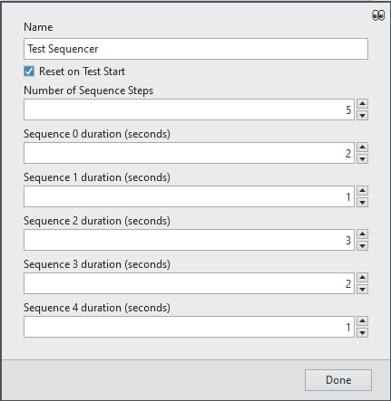
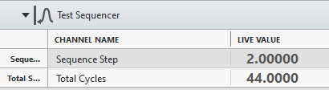
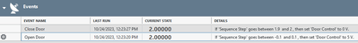
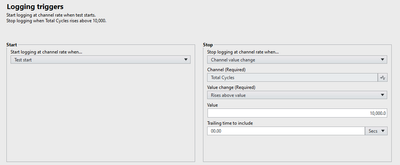

# FlexLogger Test Sequencer Plug-in

This plug-in cycles through a user specified number of steps sequentially with a user defined time period between each step.

## PDK version used to build the plug-in

1.7

## Supported versions of FlexLogger:

2023 Q3 and above

## Getting Started

After adding the plug-in, click on the gear on right side of the plugin to get this UI:

Here you can specify the number of steps and the time to stay at each step in the sequence. There is also a boolean flag to indicate if the cycles and step should reset when the test starts.

After configuring this, there are two channels produced by this step:

- Sequence Step - The zero based step index that is currently waiting for a time period before moving to the next step.
- Total Cycles - The number of times all the steps have completed and the sequence has started over at the beginning.

You can have multiple instances of this plug-in if you have different sets of sequences to go through to control your project.
The Sequence Step could be used with the Test Specification tab to create Events that drive output channels to specific values at certain steps of the sequence:

You can also use the logging stop trigger to have the test stop after a certain number of cycles:
  

## Support

Please report any problem by filing an issue in github or in the FlexLogger forum:
https://forums.ni.com/t5/FlexLogger/bd-p/1021
