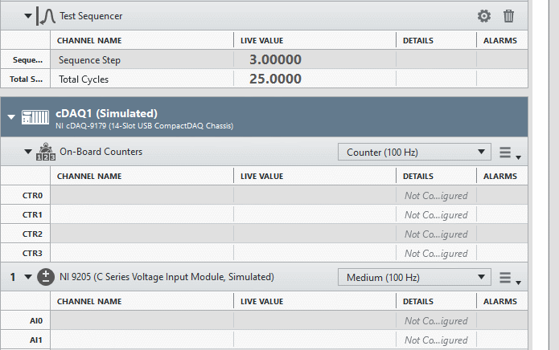

# FlexLogger Test Sequencer Plug-in

This plug-in cycles through a user specified number of steps sequentially with a user defined time period between each step. Here is a sample of what it looks like:

## PDK version used to build the plug-in

1.3

## Supported versions of FlexLogger:

2020 R4 and above

## Getting Started

- Copy the **build/Test Sequencer** folder from this repo to C:\Users\Public\Documents\National Instruments\FlexLogger\Plugins\IOPlugins
- Launch FlexLogger and open a project
- Add the Test Sequencer plug-in by selecting Add channels>>Plug-in>>Test Sequencer
- Click the configure (gear) button on the right hand side of the plug-in
- Here you can specify the number of steps and the time to stay at each step in the sequence. 
- There is also a boolean flag to indicate if the cycles and step should reset when the test starts. This plug-in uses a callback in the **Handle Notification.vi** to know when the test starts.

- Press **Done**. After configuring this, there are two channels produced by this step:

- Sequence Step - The zero based step index that is currently waiting for a time period before moving to the next step.
- Total Cycles - The number of times all the steps have completed and the sequence has started over at the beginning.

You can have multiple instances of this plug-in if you have different sets of sequences to go through to control your project.

The Test Sequencer plug-in could be used with the Test Specification tab to create Events that drive output channels to specific values at certain steps of the sequence:

You can also use the logging stop trigger to have the test stop after a certain number of cycles:

  

## Support

Please report any problem by filing an issue in github or in the FlexLogger forum:
https://forums.ni.com/t5/FlexLogger/bd-p/1021
