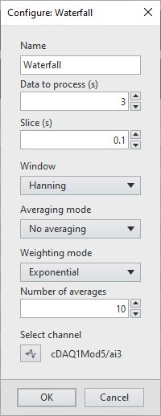
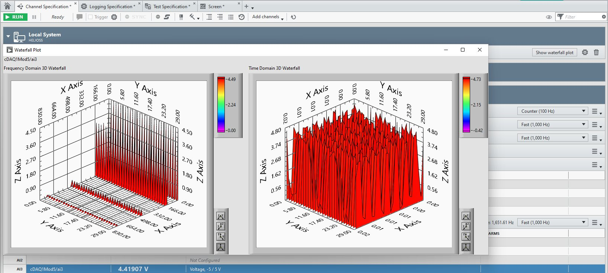

# FlexLogger Waterfall Plug-in

This plug-in demonstrates how to display an external window using the PDK that shows a 3D waterfall graph of a channel.
The plug-in displays 2 waterfall graphs: one of the Power Spectrum of the channel, the second is the time domain waterfall of the channel.

## PDK version used to build the plug-in

24.5

## Supported versions of FlexLogger:

2024 Q4 and above

## Getting Started

- Copy the content of the build folder in C:\Users\Public\Documents\National Instruments\FlexLogger\Plugins\IOPlugins\Waterfall
- Launch FlexLogger
- Configure a channel
- Invoke the Waterfall plug-in by selecting Add channels>>Plug-in>>Waterfall
- Click the configure (gear) button on the right hand side of the plug-in.
- Choose the options, select a channel to compute the waterfall and click OK.

- A windows pops up showing the waterfall graphs of the channel.
- If you close the window, you can reopen it by clicking the "Show waterfall plot" button on the right hand side of the plug-in.

## Support

Please report any problem by filing an issue in github or in the FlexLogger forum:
https://forums.ni.com/t5/FlexLogger/bd-p/1021
